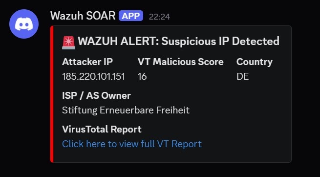
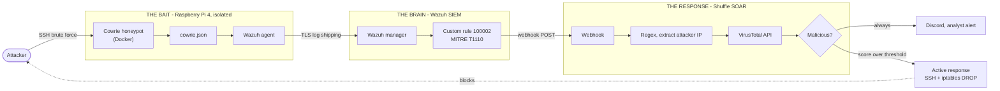

# Automated Incident Response: A Raspberry Pi Honeypot with Wazuh and Shuffle

A honeypot sat on the edge of the network, a SIEM in the middle, and a SOAR platform that blocks the attacker without waiting for a human to click anything. Built end to end on open source tooling and a Raspberry Pi.

A real capture. The IP `185.220.101.151` is a Tor exit node that hit the honeypot, got scored by VirusTotal, was reported to the analyst and then dropped at the firewall, all without a human being involved.

## The problem

In the average SOC environment, analysts are thrown thousands of alerts daily. This is known as alert fatigue, and it is basically what happens when the same low priority alert appears five hundred times a shift and people stop reading it. Attackers know this. A targeted attack which avoids specific trigger thresholds hides inside the noise, and the gap between detection (seeing the alert) and response (stopping the attack) is where the most amount of damage occurs.

Large organisations solve this by buying their way out of it. Splunk Phantom, CrowdStrike Falcon and Cortex XSOAR all do the job well, however they come with ridiculous licensing costs which put them out of reach of a small or medium sized business. This leaves smaller organisations reliant on manual, error prone processes.

I wanted to find out whether the same job could be done with tooling that costs nothing.

## Architecture

The pipeline is made up of three components, and I have named them by what they do rather than what they are.

**The Bait** is a Raspberry Pi 4 running Cowrie. A honeypot is a trap designed to look like a vulnerable system in order to lure attackers in, and Cowrie is a medium interaction SSH honeypot which pretends to be a badly secured Linux box. When a threat actor tries to log into the SSH port, Cowrie tricks them into thinking they have successfully logged in and gained root access, then records every command they type. The hardware is deliberately cheap and deliberately isolated. If an attacker somehow manages to break out of the Cowrie container, they are just stuck on a Raspberry Pi and cannot pivot to my actual computer or server.

**The Brain** is Wazuh, an open source security platform providing unified XDR and SIEM protection. It reads the honeypot logs, matches them against detection rules that I wrote, and decides what actually deserves attention. Wazuh was selected not because it is the most advanced platform available, but because it is the only one of the realistic options which a small business could actually afford to run.

**The Response** is Shuffle. SOAR stands for Security Orchestration, Automation and Response, and it is the component that wires the other tools together so that a detection can trigger an action. Shuffle was chosen because it lets you build workflows visually rather than writing scripts to link everything together. This means API calls and webhooks are handled as the same feature without needing complex code to strip special characters or handle authentication headers manually.

## How the pipeline works

1. **Capture.** An attacker brute forces SSH against the Pi. Cowrie accepts one of the attempts and writes the session out to `cowrie.json`.
2. **Ship.** The Wazuh agent on the Pi monitors that file and forwards each new line to the Wazuh manager over TLS.
3. **Detect.** The manager matches the event against custom rule **100002**, which fires on a `cowrie.login.failed` event and maps it to **MITRE ATT&CK T1110 (Brute Force)**.
4. **Hand off.** An `<integration>` block in the manager config POSTs the alert as JSON straight to a Shuffle webhook.
5. **Extract.** The alert arrives carrying a huge amount of unnecessary data. A regex node is utilised here. Regex(a way of searching for specific patterns in text) pulls the attacker IP out of the muddy JSON payload and discards the rest.
6. **Enrich.** Shuffle sends that IP to the VirusTotal API. An IP address on its own means nothing, so the pipeline needs context, and VirusTotal checks the address against over seventy antivirus engines and blocklists before returning a reputation score.
7. **Report.** A Discord webhook posts a formatted card into a private channel containing the attacker IP, the malicious score, the country, the ISP and a link to the full report. This means the analyst gets a notification on their phone instead of having to sit and stare at logs.
8. **Contain.** If the score crosses the threshold, an active response node SSHes into the Pi and adds the address to the iptables blocklist, which drops the attacker.

## Securing the host

The honeypot has to expose SSH to the internet, so an incredibly important step is making sure the machine underneath it cannot be reached the same way.

The real SSH daemon on the Pi was moved off port 22, which means attackers reaching for the obvious port find Cowrie rather than the actual device. Authentication is handled by an Ed25519 key pair generated locally, and password authentication was then disabled outright in `sshd_config`. This is a method which allows me to guarantee that even if an attacker finds the real port, they fundamentally cannot log in without the cryptographic key.

Docker is utilised for every service. If the honeypot is compromised the container gets deleted and a clean one is running seconds later. The Pi also runs the Lite (headless) build of Raspberry Pi OS rather than the desktop image, which drops idle memory from roughly 1.2GB down to around 150MB and leaves the 4GB Pi enough headroom for the Cowrie and Wazuh agent containers.

## Testing it

Two attacks were run against the finished pipeline.

**Brute force.** Wazuh filtered the raw JSON payload, mapped the event to T1110 without any human intervention, and Shuffle escalated it and dropped the IP. This is every component of the pipeline firing in sequence, which is what it was built to do.

**Post breach persistence.** An attacker with root inside the container attempted to install a backdoor(`sys_updater`). Because the honeypot is containerised and the host was hardened separately, the Raspberry Pi operating system was left completely untouched. This proved that the system does not just alert on the attack, the architecture itself contains it.

## Results

The pipeline moves from detection, to enrichment, to analyst notification, to firewall block in **2 to 3 seconds**, with nobody involved. Industry benchmarks put manual triage and enrichment of a single alert somewhere between 20 and 40 minutes.

Those two figures are not measuring identical work. The human number includes investigation and judgement, whereas this pipeline covers automated tier one enrichment and containment. The point is not that the automation is smarter than an analyst. The point is that the work a tier one analyst repeats hundreds of times a day does not need a person doing it, and handing that work to a machine frees the analyst up for the parts which genuinely need a human.

## Limitations

The project is nowhere near without its flaws.

Firstly, the API bottleneck. The free VirusTotal tier allows four requests per minute. This is usually fine for a small business, however a coordinated attack from several addresses would throttle the API and back the Shuffle queue up. All an attacker would need is multiple IP addresses and a couple of minutes, so arguably this is a denial of service vector against the pipeline itself.

Another limitation is zero day attacks. Wazuh relies on specific rules that I wrote, so if an attacker uses a brand new technique that a rule has not been written for, they bypass the workflow entirely.

The last one is false positives, and this is the flaw that matters most. The workflow is 100% automated, so if an attacker spoofs the IP of a legitimate business partner then the pipeline instantly blocks that partner. A production version of this needs a human in the loop approving the block action, along with an allowlist. This is the first thing I would change.

## Repository layout

| Path | Contents |
|---|---|
| `src/wazuh/` | Custom detection rules and the agent and manager configuration |
| `src/cowrie/` | Honeypot deployment via Docker Compose |
| `src/active-response/` | The containment script, SSH and iptables |
| `playbooks/` | The exported Shuffle workflow, credentials redacted |
| `docs/` | Build and validation screenshots, phase by phase |

## Replicating this

You will need a Raspberry Pi 4 (or any always on Linux host), Docker, a Wazuh single node deployment, a Shuffle instance, and free API keys for VirusTotal and a Discord webhook.

Wazuh publish their own `wazuh-docker` repository that handles the SIEM deployment. **Change the default credentials before you expose anything.** The shipped defaults are documented publicly by Wazuh, so leaving them in place means running your SIEM on credentials which anyone can look up.

The files in `src/` are the parts specific to this build, and the screenshots in `docs/` follow the deployment in order, from provisioning the Pi through to the firewall block firing.

## What comes next

A malware analysis node. Cowrie already logs the exact URL and file hash of anything an attacker tries to download, and right now that hash is sitting there unused. Passing it to a sandbox for detonation and feeding the verdict back into the same enrichment path would add another dimension to the pipeline. Alongside that, the human in the loop approval gate on the block action, which is the thing standing between this and something that could genuinely run in production.

---

**Zeeshan Sikandar**, BSc (Hons) Cyber Security, University College Birmingham. Built as my final year individual project, 2026.
