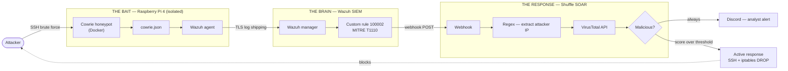

# Automated Incident Response — Wazuh · Shuffle · VirusTotal

A honeypot on the edge of the network, a SIEM in the middle, and a SOAR platform that
blocks the attacker without waiting for a human to click anything. Built end to end on
open-source tooling and a £60 Raspberry Pi.

*A real capture. `185.220.101.151` is a Tor exit node that hit the honeypot, was scored
by VirusTotal, reported to the analyst, and dropped at the firewall — start to finish,
without a human in the loop.*

---

## The problem this solves

In a normal Security Operations Centre, analysts are handed thousands of alerts a day.
This is called **alert fatigue**, and it is exactly what it sounds like: when the same
low-priority alert appears five hundred times a shift, people stop reading it. Attackers
know this. A targeted attack that stays under the alert threshold hides inside the noise,
and the gap between *seeing* an alert and *acting* on it is where the damage happens.

Large organisations solve this by buying their way out — Splunk Phantom, CrowdStrike
Falcon, Cortex XSOAR. The licensing costs put all of them out of reach of a small or
medium-sized business, which leaves smaller organisations doing the triage by hand.

I wanted to find out whether the same job could be done with tools that cost nothing.

## Architecture

Three components, and I have named them by what they do rather than what they are:

**The Bait** is a Raspberry Pi 4 running Cowrie, a medium-interaction SSH honeypot.
Cowrie pretends to be a badly-secured Linux box. When an attacker logs in, it lets them
think they have root and records every command they type. The Pi is deliberately cheap
and deliberately isolated — if someone breaks out of the container, they are stranded on
a £60 device with nothing worth reaching.

**The Brain** is Wazuh, an open-source SIEM. It reads the honeypot's logs, matches them
against detection rules I wrote, and decides what deserves attention. I chose Wazuh over
Splunk or QRadar not because it is more capable — it is not — but because it is the only
one of the three a small business can actually afford to run.

**The Response** is Shuffle, an open-source SOAR platform. SOAR means Security
Orchestration, Automation and Response: it is the piece that wires the other tools
together so a detection can trigger an action. Shuffle takes the alert, pulls out the
attacker's IP, asks VirusTotal what it knows about it, notifies the analyst, and — if the
reputation score is bad enough — blocks the address at the firewall.

## How the pipeline actually works

1. **Capture.** An attacker brute-forces SSH against the Pi. Cowrie accepts one of the
   attempts and writes the session to `cowrie.json`.
2. **Ship.** The Wazuh agent on the Pi watches that file and forwards each new line to
   the Wazuh manager over TLS.
3. **Detect.** The manager matches the event against custom rule **100002**, which fires
   on a `cowrie.login.failed` event and maps it to **MITRE ATT&CK T1110 (Brute Force)**.
4. **Hand off.** An `<integration>` block in the manager config POSTs the alert as JSON
   to a Shuffle webhook.
5. **Extract.** The alert arrives carrying far more data than is needed. A regex node
   pulls the attacker's IP out of it and discards the rest.
6. **Enrich.** Shuffle sends that IP to the VirusTotal API, which checks it against more
   than seventy antivirus engines and blocklists and returns a reputation score.
7. **Report.** A Discord webhook posts a formatted card to a private channel — attacker
   IP, malicious score, country, ISP, and a link to the full VirusTotal report. The
   analyst gets it on their phone.
8. **Contain.** If the score crosses the threshold, an active-response node SSHes into
   the Pi and adds the address to the iptables blocklist. The attacker is dropped.

## Results

The pipeline moves from **detection to enrichment to analyst notification to firewall
block in 2–3 seconds**, with no human involvement. Published industry benchmarks put
manual triage and enrichment of a single alert at 20 to 40 minutes.

Those two numbers are not measuring identical work. The human figure includes
investigation and judgement; this pipeline covers automated tier-1 enrichment and
containment. The point is not that the automation is smarter — it is that the work a
tier-1 analyst repeats hundreds of times a day does not need a person doing it, and
handing it to a machine frees that person for the work that does.

**Two attacks were run against it.**

*Brute force.* Wazuh filtered the raw JSON, mapped the event to T1110 without prompting,
and Shuffle escalated and dropped the IP. Every component of the pipeline firing in
sequence, which is what it was built to do.

*Post-breach persistence.* An attacker with root inside the container attempted to install
a backdoor (`sys_updater`). Because the honeypot is containerised and the host is
hardened separately, the Raspberry Pi's own operating system was untouched. The system
did not just alert on it — the architecture contained it.

## Hardening

The honeypot has to expose SSH to the internet, which means the host underneath it must
not be reachable the same way.

- The Pi's real SSH daemon was moved off port 22, so attackers reaching for the obvious
  port find Cowrie instead of the actual machine.
- Authentication is an **Ed25519 key pair**, generated locally. The private key never
  leaves my machine.
- Password authentication is disabled outright in `sshd_config`. Even with the real port,
  there is no password to brute-force.
- Every service runs in Docker. If the honeypot is compromised, the container is deleted
  and a clean one is running seconds later.
- Raspberry Pi OS Lite (headless) was chosen over the desktop image: idle memory drops
  from roughly 1.2GB to around 150MB, leaving the 4GB Pi enough headroom for the Cowrie
  and Wazuh agent containers.

## Limitations

This is a working prototype and it has real gaps.

**The VirusTotal free tier allows four requests per minute.** A coordinated attack from
several addresses would throttle the API and back the Shuffle queue up. For a small
business the ceiling is usually fine; under a deliberate flood it is a bottleneck, and
arguably a denial-of-service vector against the pipeline itself.

**Detection is signature-based.** Wazuh matches rules I wrote. A genuinely novel technique
with no rule behind it passes through untouched.

**Containment is fully automatic, and that cuts both ways.** If an attacker spoofs the
address of a legitimate partner, the pipeline blocks the partner. A production version
needs a human-in-the-loop approval step on the block action, and an allowlist. That is
the first thing I would change.

## Repository layout

| Path | Contents |
|---|---|
| `src/wazuh/` | Custom detection rules and the agent / manager configuration |
| `src/cowrie/` | Honeypot deployment via Docker Compose |
| `src/active-response/` | The containment script — SSH and iptables |
| `playbooks/` | The exported Shuffle workflow (credentials redacted) |
| `docs/` | Build and validation screenshots, phase by phase |

## Replicating this

You will need a Raspberry Pi 4 (or any always-on Linux host), Docker, a Wazuh single-node
deployment, a Shuffle instance, and free API keys for VirusTotal and a Discord webhook.

Wazuh's own `wazuh-docker` repository provides the SIEM deployment. **Change the default
credentials before you expose anything** — the shipped defaults are published in Wazuh's
public documentation, so leaving them in place means running on credentials anyone can
look up.

The configuration files in `src/` are the pieces specific to this build. The screenshots
in `docs/` follow the deployment in order, from provisioning the Pi through to the
firewall block firing.

## What comes next

A malware analysis node. Cowrie already records the URL and file hash of anything an
attacker tries to download, and that hash is sitting there unused — passing it to a
sandbox for detonation and feeding the verdict back into the same enrichment path is the
obvious next dimension. Alongside that, the human-in-the-loop approval gate on the block
action, which is what stands between this and something that could run in production.

---

**Zeeshan Sikandar** — BSc (Hons) Cyber Security, University College Birmingham.
Built as my final-year individual project, 2026.
